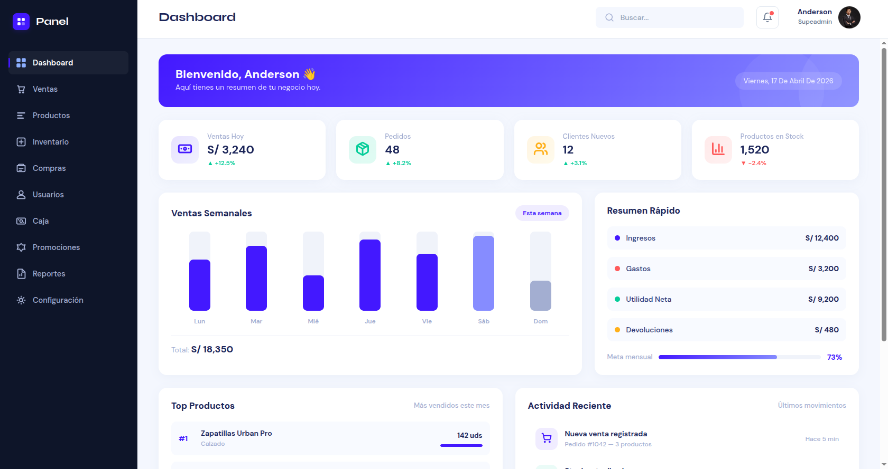
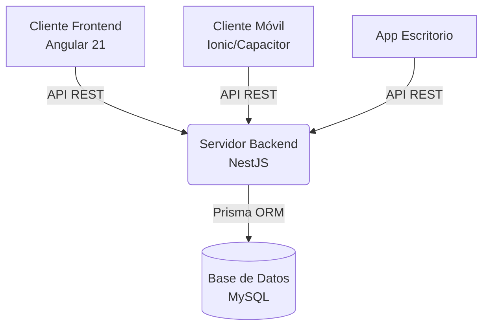

<div align="center">
  
  <br/>
  <h1>🚀 xtore - Sistema Administrativo Integral</h1>
  <p>
    <b>Potencia, escalabilidad y control total sobre tu negocio.</b>
  </p>
  <p>
    
    
    
    
    
  </p>
</div>

---

## 📖 Descripción

**xtore** es un ecosistema de software modular diseñado para la gestión integral de empresas. A través de una arquitectura moderna, unifica en una sola plataforma todas las operaciones críticas: ventas, inventario, reportes, usuarios y mucho más. 

El proyecto está dividido en múltiples plataformas (Web, Móvil, Escritorio) respaldadas por un backend robusto y un diseño orientado a la escalabilidad.

## ✨ Características Principales

Nuestro panel de control ofrece una suite completa de herramientas empresariales:

*   📊 **Dashboard Interactivo:** Resumen en tiempo real del estado de tu negocio.
*   🛒 **Punto de Venta (Ventas y Caja):** Flujo de caja ágil y gestión de ventas en mostrador.
*   📦 **Inventario y Productos:** Control detallado de stock, compras, marcas, categorías y presentaciones.
*   🤝 **Usuarios y Configuración:** Gestión de roles, accesos y parámetros del sistema.
*   📈 **Reportes y Analítica:** Toma decisiones basadas en datos con reportes generados al instante.
*   🤖 **Integración con IA:** Módulos inteligentes para potenciar y automatizar la operación.

## 🏗️ Arquitectura del Sistema

El ecosistema de **xtore** está estructurado en módulos independientes para garantizar flexibilidad y mantenimiento continuo:



*   📁 **`frontend/`**: Aplicación web SPA moderna construida con Angular v21, PrimeNG y Nebular.
*   📁 **`backend/`**: API RESTful robusta usando NestJS y Prisma ORM (con esquemas modulares).
*   📁 **`movil/` & `desktop/`**: Clientes preparados para distribución nativa y multiplataforma.
*   📁 **`db/`**: Definiciones y scripts SQL de la base de datos principal.
*   📁 **`scripts/`**: Automatizaciones bash para compilar, limpiar y gestionar Git.

## 🚀 Instalación y Despliegue

La forma más rápida de levantar el entorno de desarrollo es utilizando nuestros scripts de automatización o Docker.

### Opción 1: Docker (Recomendado)
Levanta los servicios de backend y frontend simultáneamente:
```bash
docker-compose up --build
```

### Opción 2: Scripts Nativos
1. Clona el repositorio de xtore.
2. Navega al directorio de scripts:
   ```bash
   cd scripts
   ```
3. Ejecuta el entorno de inicio:
   ```bash
   ./git_start.sh
   ```

## 🤝 Contribuir

¡Agradecemos las contribuciones! Si deseas mejorar **xtore**, sigue estos pasos:

1. Haz un *fork* del repositorio.
2. Crea tu rama: `git checkout -b feature/nueva-funcionalidad`
3. Haz *commit* de tus cambios: `git commit -m "feat: agrega nueva funcionalidad"`
4. Haz *push* a la rama: `git push origin feature/nueva-funcionalidad`
5. Abre un **Pull Request**.

---
<div align="center">
  <p>Construido con ❤️ por el equipo de <b>xtore</b></p>
  <a href="mailto:support@xtore.com">support@xtore.com</a>
</div>
